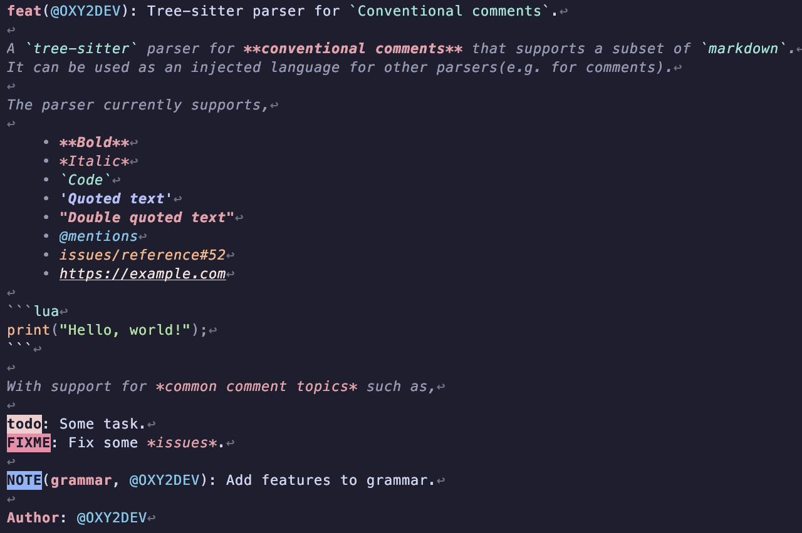

# tree-sitter-doctext



[Tree-sitter](https://github.com/tree-sitter/tree-sitter) parser for [conventional comments](https://conventionalcomments.org/).

>[!NOTE]
> It wasn't named `tree-sitter-comment` as that name is already taken and this parser isn't strictly for `comments`.

## 💡 Features

- Supports for a subset of `markdown` such as,
    + *Italic text*
    + **Bold text**
    + `Inline_code`
    + `Code blocks`
- Support for extra syntax such as,
    + `'Single quoted text'`
    + `"Double quoted text"`
    + `@mentions`
    + `owner/repo#12`(Issue reference)
    + `https://example.com`(links)
- Supports correct tree structure for topics, subjects, description.
- Queries for common comment topics(e.g. NOTE, WIP, FIX etc.).

## 📥 Installation

### 💡 nvim-treesitter

>[!IMPORTANT]
> If you plan on using it inside comments, you also need to add it as an injection for that language.

Put this in your `nvim-treesitter` config,

```lua
local parser_configs = require("nvim-treesitter.parsers").get_parser_configs();

parser_configs.doctext = {
    install_info = {
        url = "https://github.com/OXY2DEV/tree-sitter-doctext",
        files = { "src/parser.c" },
        branch = "main",
    },
}
```

Now, quit & open Neovim and run this command,

```vim
:TSInstall doctext
```

### 💡 manual

1. Install the `tree-sitter` CLI tool.

2. Clone the repository in your machine and `cd` into it.

3. Run `tree-sitter build`(if it tells you to install dependencies then you should install them and retry).

4. Copy the `doctext.so` file to `~/.config/nvim/parser/`.

## 💥 Query files(syntax highlighting & injections)

Copy everything inside `queries/` to `~/.config/nvim/queries/doctext/` in your machine.

